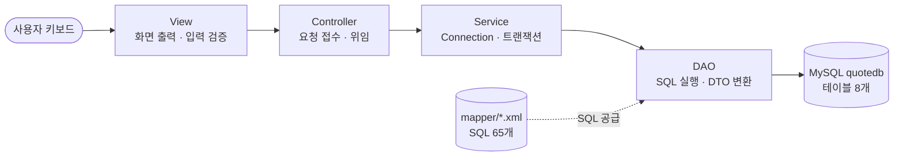
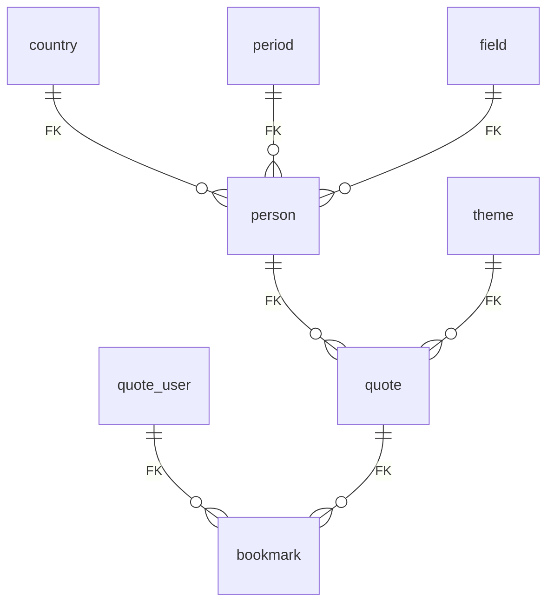

<!--
  Quote-Collection 팀 저장소 README 초안 (2026-08-31)
  - 검토 후 팀 repo의 README.md로 교체해 올리는 용도.
  - 비어 있는 곳 2군데: ①팀원별 담당(R&R) 표  ②문서(노션) 링크 공개 여부
  - 근거: origin/develop 7549e32 (PR #28 관리자 연결 반영, 수치 전부 실측 — SQL 65개, 파일 66개, 커밋 163회)
-->

# Quote Collection — 명언 도감

> 고민이 있는 날, 나에게 맞는 명언을 찾아 간직한다.

콘솔에서 명언을 탐색·검색하고 즐겨찾기로 수집하는 **Java + MySQL(JDBC) 팀 프로젝트**입니다.
국가·시대·분야·주제라는 4개의 축으로 인물과 명언을 정리한 "명언 도감"을 만들었습니다.

## 1. 소개

- **무엇을**: 명언 30편과 인물 10명을 시드로 갖춘 도감에서 — 전체·주제별·인물별·키워드로 명언을 찾고, 마음에 드는 명언을 즐겨찾기에 담아 My Page에서 다시 봅니다. 하루에 하나 "오늘의 명언"도 뽑아 줍니다.
- **왜**: 부트캠프에서 배운 Java 문법 · JDBC · MySQL · 4계층 설계 · GitHub 협업을 한 프로젝트 안에서 전부 실전으로 써 보는 것이 목표였습니다.
- **어떻게**: 화면(View) → 흐름(Controller) → 판단(Service) → DB(DAO) 4계층으로 나누고, SQL은 자바 코드 밖 XML 파일에 분리했습니다.

## 2. 팀 — Quote Hunters (1팀)

| 이름 | 담당     | GitHub                                           |
|---|----------|--------------------------------------------------|
| 고동희 | PM       | [@kodonghui](https://github.com/kodonghui)       |
| 박찬웅 | DB       | [@ParkChanwong](https://github.com/ParkChanwong) |
| 방수영 | 문서     | [@suyoungbang](https://github.com/suyoungbang) |
| 이규원 | 형상관리 | [@triglan](https://github.com/triglan) |
| 조은지 | 문서     | [@eunji-222](https://github.com/eunji-222) |

<!-- TODO(팀): 담당 도메인·기능군을 채워 주세요. 5명 전원이 커밋에 참여했습니다. -->

## 3. 주요 기능 (48개)

| 기능군 | 개수 | 내용 |
|---|---|---|
| 카테고리(기준정보) | 16 | 국가·시대·분야·주제 4종의 등록·조회·수정·삭제 |
| 인물 | 13 | 등록 · 7종 조회(전체/국가별/시대별/분야별 등) · 수정 · 삭제 |
| 명언 | 8 | 전체·주제별·인물별·키워드 검색, 오늘의 명언, 등록·수정·삭제 |
| 회원 · My Page | 8 | 회원가입 · 로그인 · 비밀번호 변경 · 즐겨찾기 추가/목록/취소 |
| 공통 | 3 | 입력 검증 · 화면 이동(0=뒤로가기) · 결과 메시지 규약 |

로그인 권한에 따라 메뉴가 갈립니다 (0=관리자, 1=사용자). 즐겨찾기는 사용자 전용입니다.

- 대표 사용자 흐름: **로그인 → 키워드 검색("사랑" → 4건) → 명언 상세 → 즐겨찾기 추가 → My Page에서 확인 → 취소**
- 대표 관리자 흐름: **관리자 로그인 → 기준정보(국가·시대·분야·주제)·인물·명언 등록·수정·삭제**

기능 하나하나가 정상 경로뿐 아니라 **예외 경로(오입력·빈 결과·중복·취소)**까지 처리합니다 — 프로젝트 전체에 예외 처리(catch) 112곳.

## 4. 아키텍처



| 계층 | 하는 일 | 하지 않는 일 |
|---|---|---|
| View (11개) | 메뉴 출력, 키보드 입력, 입력 검증 | SQL, DB 연결 |
| Controller (8개) | "이건 무슨 업무"인지 판단해 위임 | 화면 출력, SQL |
| Service (8개) | DB 연결 열기/닫기, commit/rollback | 화면 출력 |
| DAO (8개) | XML에서 SQL을 꺼내 실행, ResultSet → DTO 변환 | 트랜잭션 결정 |

- SQL은 전부 `mapper/*.xml`에 분리 (**65개**: SELECT 32 · INSERT 8 · UPDATE 11 · DELETE 14) — SQL을 고칠 때 자바 코드를 건드리지 않습니다.
- 모든 SQL은 `PreparedStatement`의 `?` 와일드카드 바인딩을 사용합니다 (SQL 인젝션 방어).

## 5. 데이터베이스 설계



테이블 8개 — 기준정보 4(country·period·field·theme) + 핵심 3(person·quote·quote_user) + 연결 1(bookmark).

| 제약 | 개수 | 대표 예 |
|---|---|---|
| PRIMARY KEY (AUTO_INCREMENT) | 8 | 모든 테이블 |
| FOREIGN KEY — 전부 `ON DELETE CASCADE` | 7 | 인물 삭제 → 그 인물의 명언·즐겨찾기 연쇄 정리 |
| UNIQUE | 6 | `uq_bookmark_member_quote` — 같은 회원이 같은 명언을 두 번 즐겨찾기 못 함 |
| CHECK | 1 | `user_auth IN (0, 1)` — 0=관리자, 1=사용자 |

즐겨찾기 중복은 3겹으로 방어합니다: 화면에서 상태 표시 → Service에서 재확인 → DB UNIQUE가 최후 방어선.

## 6. 시작하기

### 요구사항

- JDK (Java 17 이상 권장) · MySQL 8.x · IntelliJ IDEA
- Gradle은 설치 불필요 — 저장소의 래퍼(`gradlew`, 9.6.0)가 대신 내려받습니다

### DB 준비 (순서 중요)

```
sql/ 폴더의 스크립트를 순서대로 실행합니다.
① CREATE_USER_DATABASE.sql  — root 계정으로: quotecollection 계정 + quotedb 생성 (마지막 USE는 새 계정으로)
② CREATE_TABLE_SCRIPT.sql   — 테이블 8개 생성
③ INSERT_DATA.sql           — 초기 데이터 92행 입력 (몇 번을 다시 돌려도 같은 상태가 됩니다)
```

접속 정보는 `src/main/java/com/quotehunters/quotecollection/config/connection-info.properties`에서 확인·수정합니다.

### 실행

IntelliJ에서 `run/Application.java`의 `main`을 실행합니다 (콘솔 애플리케이션).

### 시드 계정

| 아이디 | 비밀번호 | 권한 |
|---|---|---|
| admin01 / admin02 | adminpw01 / adminpw02 | 관리자(0) |
| user01 ~ user04 | password01 ~ password04 | 사용자(1) |

> user01은 즐겨찾기 2건을 이미 갖고 시작합니다 — My Page 시연용.

## 7. 프로젝트 구조

```
Quote-Collection/
├─ .github/
│   └─ pull_request_template.md        ← PR을 열면 자동으로 채워지는 본문 양식
├─ .gitignore                          ← git이 추적하지 않을 파일 목록
├─ README.md                           ← 프로젝트 소개(이 문서)
├─ build.gradle                        ← 빌드 설계도(의존성·인코딩 설정)
├─ settings.gradle                     ← 프로젝트 이름 선언 한 줄
├─ gradlew                             ← Gradle 래퍼 실행 스크립트(macOS/Linux용)
├─ gradlew.bat                         ← Gradle 래퍼 실행 스크립트(Windows용)
├─ gradle/
│   └─ wrapper/
│       ├─ gradle-wrapper.jar          ← 래퍼 본체(지정 버전 Gradle을 내려받는 프로그램)
│       └─ gradle-wrapper.properties   ← 어떤 Gradle을 받을지 적은 명세(9.6.0)
├─ sql/                                ← 실행 전에 사람이 직접 돌리는 DB 준비 스크립트 3종
│   ├─ CREATE_USER_DATABASE.sql        ← ① 계정 quotecollection + DB quotedb 생성
│   ├─ CREATE_TABLE_SCRIPT.sql         ← ② 테이블 8개 생성
│   └─ INSERT_DATA.sql                 ← ③ 초기 데이터 92행 입력
└─ src/main/java/com/quotehunters/quotecollection/
    ├─ run/
    │   └─ Application.java            ← 프로그램 시작점. main 메소드 하나뿐
    ├─ common/
    │   └─ JDBC.java                   ← DB 연결·닫기·commit·rollback 공용 도구
    ├─ config/
    │   └─ connection-info.properties  ← DB 접속 정보(드라이버·주소·계정)
    ├─ view/                           ← 화면 계층: 도메인 8개 + 공용 3개 = 11개
    │   ├─ MainView.java               ← 공용: 첫 메뉴와 전체 흐름의 시작
    │   ├─ ScannerView.java            ← 공용: 키보드 입력(Scanner) 관리
    │   ├─ ResultView.java             ← 공용: 성공/실패 메시지 출력
    │   ├─ BookmarkView.java  CountryView.java  FieldView.java
    │   ├─ MemberView.java    PeriodView.java   PersonView.java
    │   └─ QuoteView.java     ThemeView.java
    ├─ controller/                     ← 흐름 계층: 도메인별 8개
    │   ├─ BookmarkController.java  CountryController.java
    │   ├─ FieldController.java     MemberController.java
    │   ├─ PeriodController.java    PersonController.java
    │   └─ QuoteController.java     ThemeController.java
    ├─ model/
    │   ├─ service/                    ← 판단 계층: 도메인별 8개 (BookmarkService … ThemeService)
    │   ├─ dao/                        ← DB 계층: 도메인별 8개 (BookmarkDAO … ThemeDAO)
    │   └─ dto/                        ← 데이터 상자: 도메인별 8개 (BookmarkDTO … ThemeDTO)
    └─ mapper/                         ← SQL 보관함: 도메인별 XML 8개
        ├─ bookmark-query.xml  country-query.xml  field-query.xml
        ├─ member-query.xml    period-query.xml   person-query.xml
        └─ quote-query.xml     theme-query.xml
```

## 8. 협업 방식

- **브랜치 전략**: `main`(안정) ← `develop`(통합) ← `feature/*`(기능별 작업). 작업은 전부 PR로 `develop`에 병합합니다.
- **PR 템플릿**: `.github/pull_request_template.md` — PR을 열면 변경 요약·확인 사항이 자동으로 채워집니다.
- **커밋 컨벤션**: `feat:` `fix:` `refactor:` `style:` 접두사 (예: `feat: Favorite-002 즐겨찾기 목록 조회 및 Favorite-003 즐겨찾기 취소 구현`)
- **기록**: 커밋 163회 · 병합(PR) 24회, 5명 전원 커밋 참여 (2026-08-27 ~ 08-31)

## 9. 숫자로 보는 프로젝트

| 항목 | 수치 |
|---|---|
| 소스 파일 | 66개 (Java 45 · mapper XML 8 · SQL 3 외) |
| 작성한 SQL | 65개 (SELECT 32 · INSERT 8 · UPDATE 11 · DELETE 14) |
| 예외 처리 지점 | catch 112곳 (View 입력 검증 → Service rollback → DB 제약, 계층별 분담) |
| 초기 데이터 | 92행 (계정 6 · 기준정보 40 · 인물 10 · 명언 30 · 즐겨찾기 6) |

## 10. 알려진 한계와 개선 계획

- **비밀번호 평문 저장** — 학습 범위상 해시를 다루지 않았습니다. BCrypt 도입이 1순위 개선안입니다.
- **테스트 코드 부재** — JUnit 의존성은 준비되어 있어, 핵심 Service부터 단위 테스트를 붙일 계획입니다.
- **DB 접속 정보가 저장소에 포함** — 로컬 학습용 계정이지만, 환경변수 또는 무시(.gitignore) 대상 설정 파일로 분리할 예정입니다.

## 11. 문서

<!-- TODO(팀): 공개할 링크만 남겨 주세요 -->
- [기능명세서 (노션)](https://app.notion.com/p/ohgiraffers/3c8649136c1180d5a111f5e31e8a2f2b?v=d06649136c11822d98a9082ed410d610&source=copy_link)
- [DB 설계서 (노션)](https://app.notion.com/p/ohgiraffers/050649136c1182b68da501fa23418017?source=copy_link)